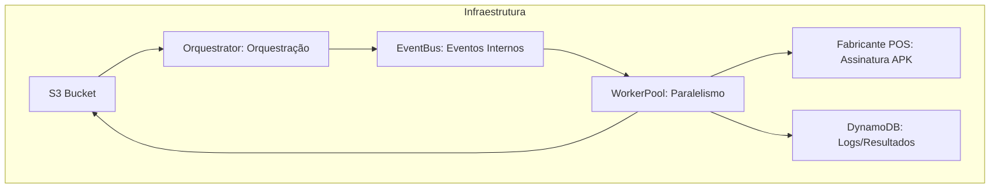
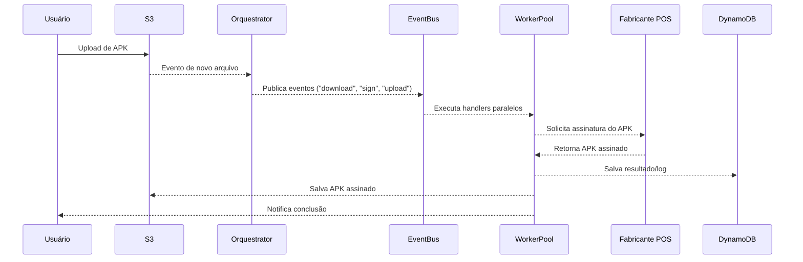

# Arquitetura Atual do demo-signserver

Este documento descreve a arquitetura do projeto, fluxos principais e integrações.

## Diagrama de Arquitetura

## Diagrama de Sequência do Fluxo

## Fluxograma Geral

Consulte `docs/fluxogramas.md` para fluxogramas detalhados do fluxo ponta-a-ponta e observabilidade.

---

> **Observação:** O fluxo inicia após a criação de um arquivo no S3, disparando todo o processo de assinatura e orquestração descrito acima.
