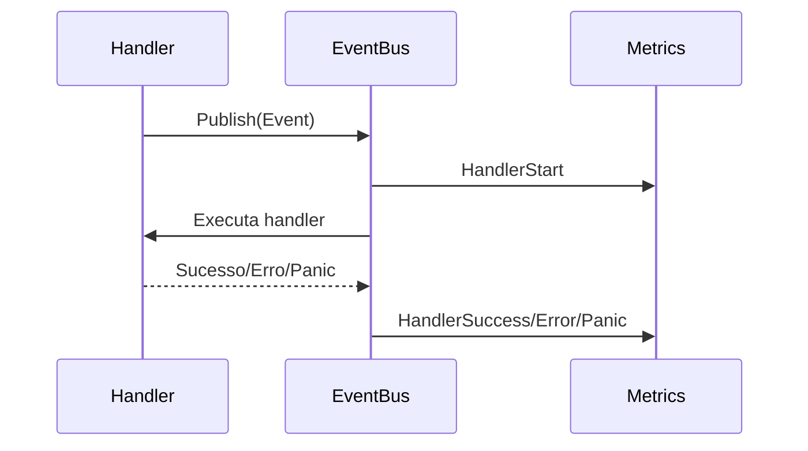

# Fluxograma Geral — demo-signserver

```mermaid
graph TD
    subgraph Usuário
        U[Usuário]
    end
    subgraph API
        API[API HTTP/gRPC]
    end
    subgraph Intent
        INT[Intent Service]
    end
    subgraph Storage
        S3[S3 Bucket]
    end
    subgraph Orquestração
        ORCH[Orchestrator]
        WP[WorkerPool]
    end
    subgraph Assinatura
        SIGN[Signing Service]
    end
    subgraph Notificação
        NOTIF[Notification Service]
    end
    U-->|Solicita assinatura|API
    API-->|Cria intent, retorna URL|INT
    INT-->|Gera URL upload|S3
    U-->|Upload APK|S3
    S3-->|Evento S3|ORCH
    ORCH-->|Enfileira evento|WP
    WP-->|Processa assinatura|SIGN
    SIGN-->|Salva APK assinado|S3
    SIGN-->|Atualiza intent|INT
    SIGN-->|Notifica usuário|NOTIF
    NOTIF-->|Webhook/Status|U
```

---

# Fluxo de Observabilidade



---

> **Observação:** Os fluxogramas acima representam o fluxo ponta-a-ponta do sistema e o ciclo de observabilidade dos eventos.
