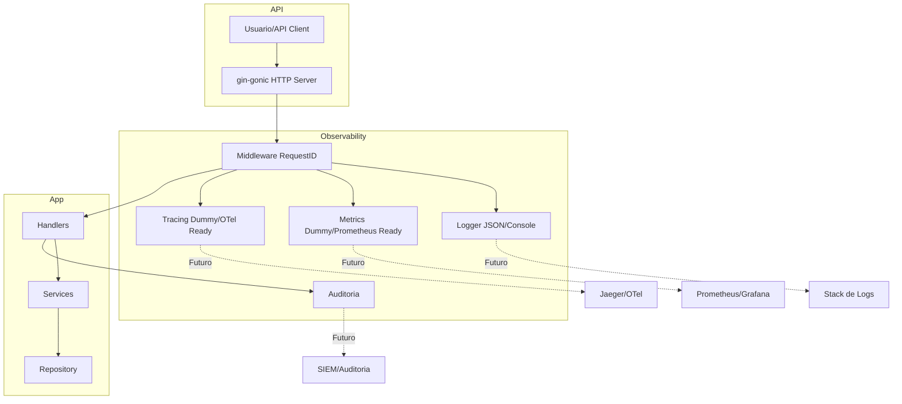
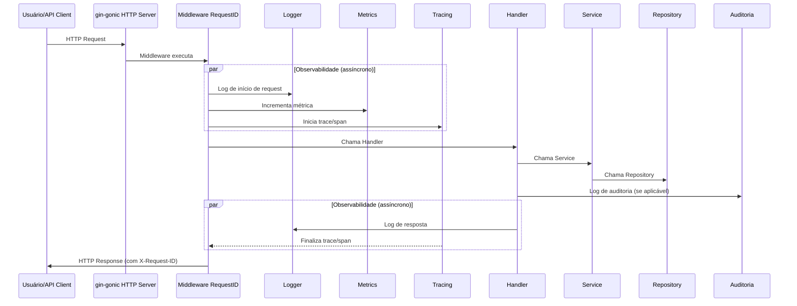

s# Documento Técnico de Observabilidade

## Visão Geral

Este documento detalha a estrutura técnica que será implementada para garantir observabilidade no projeto demo-signserver, mesmo sem ferramentas externas instaladas inicialmente. O objetivo é garantir que, ao adicionar ferramentas como Prometheus, Grafana, Jaeger ou stacks de logging, a integração seja simples e sem refatorações profundas.

---

## 1. Logging Estruturado

### Objetivo

Permitir logs legíveis por máquina e facilmente integráveis com sistemas de análise, mesmo que inicialmente apenas no console.

### Implementação

- Criação de um pacote `logger` com uma interface Logger (Info, Warn, Error, WithFields).
- Implementação inicial usando o log padrão do Go (`log.Printf`), mas formatando as mensagens em JSON.
- Todos os handlers, serviços e middlewares devem usar o logger, nunca o log direto.
- Exemplo de log:
  ```json
  {
    "timestamp": "2025-07-02T12:00:00Z",
    "level": "info",
    "requestID": "abc-123",
    "msg": "Request recebida",
    "endpoint": "/requests"
  }
  ```
- Facilidade para trocar a implementação para zap, logrus ou zerolog no futuro.

---

## 2. Middleware de requestID

### Objetivo

Gerar e propagar um identificador único de requisição para rastreabilidade ponta-a-ponta.

### Implementação

- Middleware Gin que verifica se existe um header `X-Request-ID`. Se não existir, gera um UUID.
- O requestID é adicionado ao contexto da request e aos logs.
- O header `X-Request-ID` é devolvido em todas as respostas.
- Exemplo de uso:
  ```go
  logger := logger.WithFields(map[string]interface{}{"requestID": requestID})
  logger.Info("Iniciando request")
  ```

---

## 3. Estrutura para Métricas

### Objetivo

Permitir instrumentação de métricas de negócio e técnicas, mesmo que inicialmente só faça log.

### Implementação

- Criação de um pacote `metrics` com funções para registrar contadores, histogramas, etc.
- Implementação inicial apenas incrementando contadores em memória e logando eventos.
- Endpoint `/metrics` já criado, retornando métricas dummy ou logs.
- Estrutura pronta para integrar Prometheus futuramente.

---

## 4. Estrutura para Tracing

### Objetivo

Permitir rastreamento de chamadas entre handlers, serviços e dependências.

### Implementação

- Criação de um pacote `tracing` com funções para iniciar/finalizar spans.
- Inicialmente, apenas logar início/fim de spans com requestID e nome da operação.
- Estrutura pronta para integrar OpenTelemetry/Jaeger.

---

## 5. Auditoria

### Objetivo

Registrar operações sensíveis para rastreabilidade e compliance.

### Implementação

- Função utilitária para registrar logs de auditoria (ação, usuário, timestamp, payload).
- Logs de auditoria separados por campo ou arquivo (pode ser só um campo extra no log padrão).

---

## 6. Estrutura de Código

- Todos os logs, métricas e tracing devem ser feitos via interfaces/pacotes próprios.
- Nunca usar log direto, print, ou métricas hardcoded nos handlers/serviços.
- O código já estará pronto para plugar ferramentas externas sem refatoração.

---

## Exemplo de Estrutura de Pastas

```
internal/
  observability/
    logger.go
    metrics.go
    tracing.go
```

---

## Próximos Passos

1. Implementar pacote logger estruturado.
2. Adicionar middleware de requestID.
3. Implementar pacotes de métricas e tracing (dummy).
4. Refatorar handlers/serviços para usar as interfaces.
5. Documentar exemplos de uso para desenvolvedores.

---

## Diagramas de Observabilidade

### Diagrama de Arquitetura (Mermaid)



### Diagrama de Sequência (Mermaid)



---

Este documento deve ser revisado e expandido conforme a evolução do projeto e a adoção de ferramentas externas.
